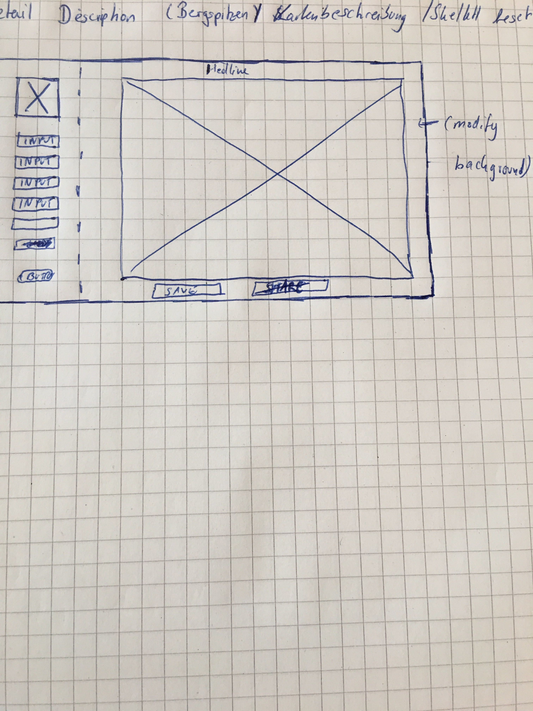

# Detail Describer

# Find a project

- Website to inscribe detailed information (e.g. Mountain peaks)

## Wireframe

# Milestones

- [x] Build a structure in VScode with all files needed
- [x] Build HTML structure
- [x] Build aside with the picture and the input fields
- [x] build main
- [ ] design with scss
- [ ] show the content of inputfields in picture
